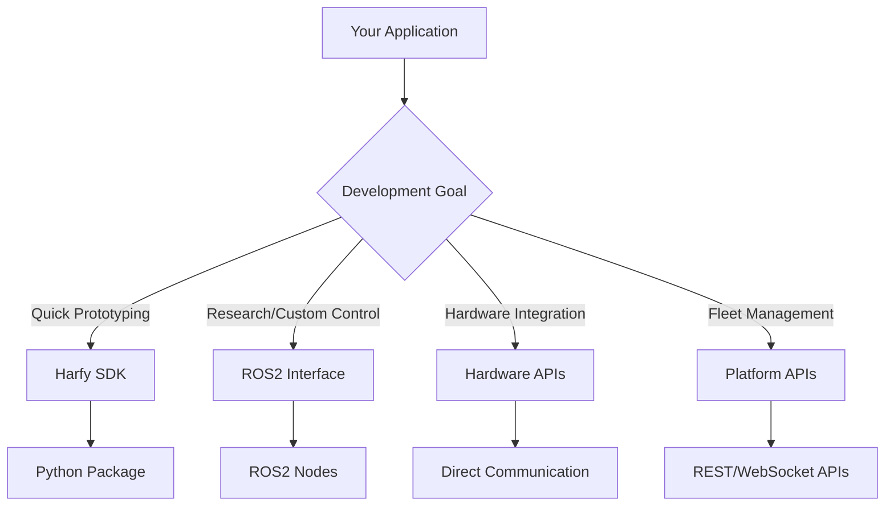

# API Reference Overview

Comprehensive technical documentation for all AutoGence APIs and interfaces. Whether you're building with the high-level Harfy SDK or working directly with hardware components, you'll find detailed guides and examples here.

## API Categories

### Harfy SDK
**High-level Python API for robot control**
- Movement and locomotion control
- Sensor data access and processing
- Pre-built behaviors and animations
- Event-driven programming model

Perfect for: Rapid prototyping, educational projects, high-level applications

**Coming Soon**: Explore Harfy SDK documentation

### ROS2 Interface
**Low-level robotics framework integration**
- Direct joint control and feedback
- Real-time sensor streams
- Custom node development
- Integration with existing ROS ecosystems

Perfect for: Research applications, custom control algorithms, advanced robotics

**Coming Soon**: ROS2 Interface documentation

### Hardware APIs
**Direct component communication**
- Robot Domain Controller interface
- Actuator control and configuration
- Sensor calibration and data access
- EtherCAT real-time communication

Perfect for: Hardware integration, custom robots, system-level development

**Coming Soon**: Hardware API documentation

### Software Platform
**Fleet management and remote operations**
- OTA update client integration
- Management dashboard APIs
- Teleoperation setup and control
- PKI security configuration

Perfect for: Production deployments, fleet management, remote operations

**Coming Soon**: Platform API documentation

## Getting Started

### Choose Your API Level



### Installation Quick Start

#### Harfy SDK (Recommended for beginners)
```bash
pip install harfy-sdk
```

#### ROS2 Interface
```bash
# Ubuntu 22.04 with ROS2 Humble
sudo apt install ros-humble-harfy-interface
```

#### Hardware APIs
```bash
# EtherCAT and direct communication libraries
pip install autogence-hardware
```

#### Platform APIs
```bash
# Management and teleoperation clients
pip install autogence-platform
```

## API Documentation Standards

All AutoGence APIs follow consistent patterns:

### Authentication
- **Hardware APIs**: Direct connection (no auth required)
- **Harfy SDK**: Device discovery and pairing
- **Platform APIs**: JWT tokens and API keys
- **ROS2**: ROS2 authentication mechanisms

### Response Formats
- **REST APIs**: JSON with consistent error handling
- **Real-time**: WebSocket streams with message types
- **Hardware**: Binary protocols with checksums
- **ROS2**: Standard ROS2 message formats

### Error Handling
- Consistent error codes across all APIs
- Detailed error messages with suggested fixes
- Graceful degradation when components are unavailable
- Automatic retry logic where appropriate

## Example: Your First API Call

Here's a simple example using each API to make Harfy wave:

### Harfy SDK (Recommended for beginners)
```python
from harfy import Robot

# Connect to Harfy
robot = Robot.discover()

# Make Harfy wave
robot.behaviors.wave_hello()
```

### ROS2 Interface
```python
import rclpy
from harfy_msgs.srv import ExecuteBehavior

# ROS2 service call
node = rclpy.create_node('harfy_client')
client = node.create_client(ExecuteBehavior, '/harfy/execute_behavior')

request = ExecuteBehavior.Request()
request.behavior_name = 'wave_hello'
client.call_async(request)
```

### Hardware API
```python
from autogence.hardware import DomainController

# Direct hardware control
controller = DomainController.connect()
controller.joints.set_positions({
    'right_arm_shoulder': 90,
    'right_arm_elbow': 45
})
```

### Platform API
```bash
# REST API call
curl -X POST https://api.autogence.ai/v1/robots/harfy-123/behaviors \
  -H "Authorization: Bearer $API_TOKEN" \
  -d '{"behavior": "wave_hello"}'
```

## Interactive API Explorer

Coming soon: Try our APIs directly in your browser with interactive tools for testing and development.

## Community & Support

### Open Source
Many of our API implementations are open source:
- **[harfy-sdk on GitHub](https://github.com/autogence/harfy-sdk)**
- **[ROS2 packages](https://github.com/autogence/ros2-harfy)**
- **[Hardware drivers](https://github.com/autogence/hardware-drivers)**

### Getting Help
- **[Discord #api-support](https://discord.gg/autogence)** - Real-time developer support
- **[GitHub Issues](https://github.com/autogence)** - Bug reports and feature requests
- **[API Status Page](https://status.autogence.ai)** - Service availability and incidents

### Contributing
We welcome contributions! Check out our GitHub repositories for contribution guidelines and open issues.

---

Ready to start building? Check out our **[Quick Start Guides](/docs/quick-start/intro)** for hands-on tutorials!